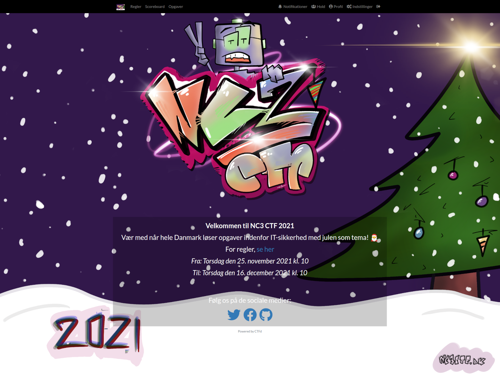
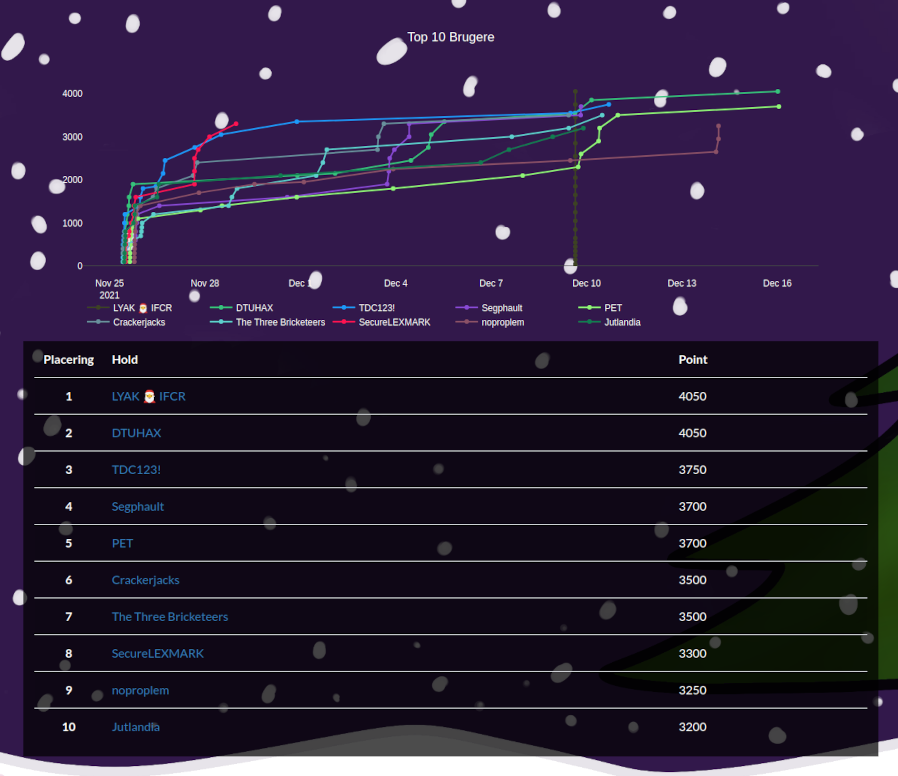

# #nc3ctf2021

NC3 har afholdt en [CTF](https://en.wikipedia.org/wiki/Capture_the_flag) siden 2017. I år fra 25. november til 16. december 2021. Dette gøres for at sætte fokus på IT-sikkerhed, og især gøre flere unge interesserede i en evt. karriere indenfor denne branche.

En CTF kan kort beskrives som en hackerkonkurrence, hvor det handler om at bryde forskellige sikkerhedsforanstaltninger. Målet med hver opgave er at finde et "flag", dvs. en tekst, som opgaven prøvede at holde hemmelig.

**URL:** https://www.nc3ctf.dk

&nbsp;
&nbsp;
&nbsp;

# Resultat

Vinderen blev ["LYAK 🎅 IFCR"](https://github.com/ly4k). Stort tillykke.

Hele dage og sene nattetimer blev taget i brug når de mere end 1100 deltagere løste opgaver. Det var fedt at se for os, der stod bag konkurrencen. Hvis vi skal sige noget overordnet om konkurrencen, så er det at vi har prøvet at skabe nogle opgaver som vi selv ville have lyst til at løse. Tak til alle for opbakningen og glædelig jul!

#nc3ctf2021

&nbsp;
&nbsp;
&nbsp;
&nbsp;

# Opgaver

Vi har virkelig prøvet at lave opgaver meget ekstrem varierende sværhedsgrader. Opgaverne er derfor inddelt i kategorierne: Begynder, Øvet og Svær. I år havde vi også nogle opgaver fra community'et, repræsenteret af CTF-holdet [Kalmarunionen](https://www.kalmarunionen.dk/). Det er vores håb at især "Begynder"-opgaverne kan blive en introduktion til IT-sikkerhed for folk, der endnu ikke har åbnet en HEX editor.

Opgaverne kan hentes [her](opgaver), men ellers kører [hjemmesiden](https://www.nc3ctf.dk) videre i Q1 2022.

&nbsp;
&nbsp;

# Writeups

Konceptet omkring writeups er enkelt: En gennemgang af hvordan en opgave kan løses.

Især i [infosec](https://en.wikipedia.org/wiki/Information_security) community'et er der en positiv tendens til at skrive writeups efter en endt CTF. Dette giver jo andre en mulighed for at se hvordan en opgave kunne løses. Hvis man f.eks. selv ikke kunne få hul på en given opgave under konkurrencen, er det derfor yderst interessant at se efterfølgende hvad man kunne have gjort. Ligeledes kunne det være at man allerede havde løst en given opgave, men gerne ville have inspiration til evt. andre løsninger.

Vi venter i år med at offentliggøre de officielle writeups til slutningen af januar 2022. Dette for at fremme lysten til at community'et skriver egne writeups, så vi alle kan lære om forskellige metoder til løsninger.

&nbsp;

&nbsp;

# Officielle Writeups

Kommer i slutningen af januar 2022.

&nbsp;

&nbsp;

# Community Writeups:

&nbsp;

## Fra Danni Randeris :

https://blog.danniranderis.dk/2021/12/16/danish-christmas-ctf-2021-by-nc3-police-the-beginner-category/

https://blog.danniranderis.dk/2021/12/16/danish-christmas-ctf-2021-by-nc3-police-intermediary-bitmap-cache/

https://blog.danniranderis.dk/2021/12/16/danish-christmas-ctf-2021-by-nc3-police-intermediary-hej-verden/

https://blog.danniranderis.dk/2021/12/16/danish-christmas-ctf-2021-by-nc3-police-intermediary-nisseminder/

https://blog.danniranderis.dk/2021/12/16/danish-christmas-ctf-2021-by-nc3-police-intermediary-zoomer/

https://blog.danniranderis.dk/2021/12/16/danish-christmas-ctf-2021-by-nc3-police-intermediary-dangerzone-1-4/

&nbsp;

Skriv og lær fra dig! Vi modtager meget gerne [pull requests](https://docs.github.com/en/free-pro-team@latest/github/collaborating-with-issues-and-pull-requests/about-pull-requests).
 
