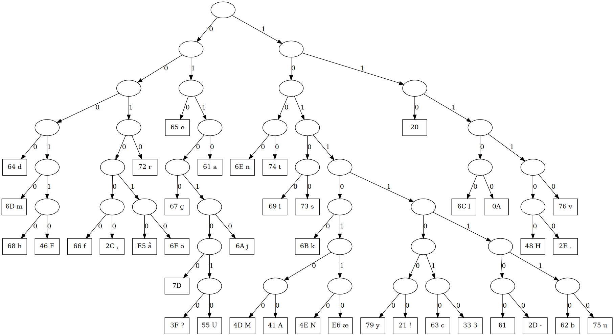

# david

Vi bliver givet en gang gibberish. Og vi ved med det samme at den David der tales om er David Huffman. Så vi er ude i noget huffman compression.

	00000000: 4d41 500a 158d d25e 3326 c6cd a670 5441  MAP....^3&...pTA
	00000010: 4227 646d 6846 662c e56f 7265 677d 3f55  B'dmhFf,.oreg}?U
	00000020: 6a61 6e74 6973 6b4d 414e e679 2163 337b  jantiskMAN.y!c3{
	00000030: 2d62 7520 6c0a 482e 764d 5347 f8ef 7cfa  -bu l.H.vMSG..|.
	00000040: 1647 81ff 406a de3c 6190 023d e358 e3da  .G..@j.<a..=.X..
	00000050: 5adb 69a7 3222 51c3 fe3d f7de f7cf d2b8  Z.i.2"Q..=......
	00000060: 146f b9ea fedc c9d5 2b7d cf02 9c5b 2a56  .o......+}...[*V
	00000070: 128a 4314 7bbc fd2b 8146 fb9e 8422 736e  ..C.{..+.F..."sn
	00000080: 251a a566 1613 ace3 9a9f 7bd1 f8ec 5391  %..f......{...S.
	00000090: e1be 8e71 0fc0 df5c 20b3 96d4 493a 69ce  ...q...\ ...I:i.
	000000a0: 5c59 62b9 ef62 eaee f1b7 6df0 29c8 f544  \Yb..b....m.)..D
	000000b0: e73a f709 461b ee1a c78c 0a72 6289 e519  .:..F......rb...
	000000c0: af8e fd8a ba69 c69d e8                   .....i...


Der går en rum tid med at forsøge at forstå hvor bitstreamen starter og hvordan selve huffmantræet er defineret.
Der er stort set intet fremskridt indtil NC3 frigiver et hint omkring størrelsen af bitstreamen og noget population count. Det med population count forstår vi stadigvæk ikke hvad vi skulle bruge til.

Til sidst finder vi ud af at man kan encode et binært træ ved recursiv traversal og notere 0 for indre nodes og 1 for leafs.

[Succint encoding](https://www.geeksforgeeks.org/succinct-encoding-of-binary-tree/)

Efter at have kodet på træ-algoritmen ...... med de fejl og omveje der er i sådan noget - blandt andet en lidt vild [Omvejng](omvej.png) finder vi vi finder ud af at trædefinitionen starter på offset 4. Der står også "MAP" og "TAB" i filen. Parser man træet fra offset 0x4 får men et træ der fylder 9 bytes og har 39 leafs. Succint encoding er selvterminerende, men vi troede at der skulle et større træ til fordi

Det endelige træ ser sådan her ud.



Og indholdet af træet starter på offset 18 efter umiddelbart efter "TAB".  Træet indeholder 39 leafs. Så med start på offset 18må det betyde at huffman bitstreamen starter på offset  57. Men det er ikke tilfældet - og vi var lang tid om at fatte det - eftersom et af hintene er at huffman bitstreamen skulle være 1117 bits (139,63 bytes). Da filen er 201 bytes stor og bitstreamen sikkert ligger til sidst må staten af bitstreamen være på offset 201-140=61 og ikke 57.

Dekoder vi bitstreamen fra offset 61 får vi flaget.

    Hvem er david? Han hedder HUFFMAN til efternavn...

    Hvis den var svær, så var det også meningen. Hvis den var nem, jamen så godt klaret.

    Flaget er hvert fald velfortjent, tillykke!

    nc3{jaja det er smart - men hvad kan det egentlig bruges til}

Her er koden vi skrev for at dekode david.

```C
#include <stdio.h>
#include <vector>
#include <stdlib.h>
#include <string>
#include <inttypes.h>

#include <assert.h>

static FILE* dotf;
static int nodecnt = 0;
static int leafcount = 0;


class bitread {
	unsigned char* _start_ptr;
	unsigned char* _ptr;
	unsigned _bitpos = 7;

public:
	int len() {
		return _ptr - _start_ptr;
	}

	bitread(unsigned char* ptr)
		: _ptr(ptr)
		, _start_ptr(ptr)
	{
	}

	char readbit() {
		auto bit = *_ptr & (1<<_bitpos);
		if (_bitpos == 0) {
			_bitpos = 7;
			_ptr++;
		} else
			_bitpos--;
		return bit ? 1 : 0;
	}
};


struct Node {
	int id;
	Node(int id) {
		this->id = id;
	}
	unsigned char data = 0;
	struct Node* left = nullptr;
	struct Node* right = nullptr;
};


Node* recurse_construct(bitread& bits, unsigned char** data) {
	auto b = bits.readbit();

	if (b == 1) { // Leaf
		auto leaf = new Node(nodecnt++);
		leafcount++;
		leaf->data = **data;
		(*data)++;
		return leaf;
	}

// 	printf("  NEW NODE %d\n", nodecnt);
	auto node = new Node(nodecnt++);
	node->left = recurse_construct(bits, data);
	node->right = recurse_construct(bits, data);
	return node;
}

Node* construct_tree(bitread& bits, unsigned char** data) {
	auto root = new Node(nodecnt++);
	root->left = recurse_construct(bits, data);
	root->right = recurse_construct(bits, data);
	return root;
}


int nullcnt = 0;
void graph_tree(Node* parent, Node* node, int direction) {
	if (!node)
		return;

	if (!node->left && !node->right) { // Leaf
		fprintf(dotf, "%d [shape=record, label=\"%02X %c\"];\n", node->id, node->data, node->data);
		fprintf(dotf, "%d -> %d [label=\"0\"];\n", parent->id, node->id);
		nullcnt++;
		return;
	}

	fprintf(dotf, "%d [label=\"\"];\n", node->id);
	if (parent) {
		fprintf(dotf, "%d -> %d [label=\"%d\"];\n", parent->id, node->id, direction);
	}

	graph_tree(node, node->left, 0);
	graph_tree(node, node->right, 1);
}


bool get_code(Node* node, bitread& bits, unsigned char* ch) {
	if (bits.len() > 139)
		return false;

	if (!node->left && !node->right) { // Leaf
		*ch = node->data;
		return true;
	}

	auto b = bits.readbit();
	if (b == 0)
		return get_code(node->left, bits, ch);
	return get_code(node->right, bits, ch);
}


void decode_tree(Node* node, bitread& bits) {
	int outcount = 0;
	unsigned char output[1024];
	int idx = 0;
	while ( get_code(node, bits, &output[idx]) ) {
		outcount++;
		idx++;
	}
	output[idx] = 0;
	printf("%s\n", output);
	printf("Output is %d bytes\n", outcount);
}

int main() {
	unsigned char buf[1024];
	auto f = fopen("david", "rb");
	auto len = fread(buf, 1, 1024, f);
	fclose(f);

	dotf = fopen("tree.dot", "wb");
	fprintf(dotf, "digraph T {\n");

	bitread treebits(&buf[4]);
	unsigned char* data = &buf[0x12];
	auto root = construct_tree(treebits, &data);
	graph_tree(nullptr, root, -1);
	fprintf(dotf, "}\n");
	fclose(dotf);
	system("dot -Tpng tree.dot > tree.png");

	bitread encbits(&buf[0x3d]);
	decode_tree(root, encbits);

	printf("%d bytes tree\n", treebits.len());
	printf("%d leafs\n", leafcount);
	printf("%d null nodes\n", nullcnt);
}
```